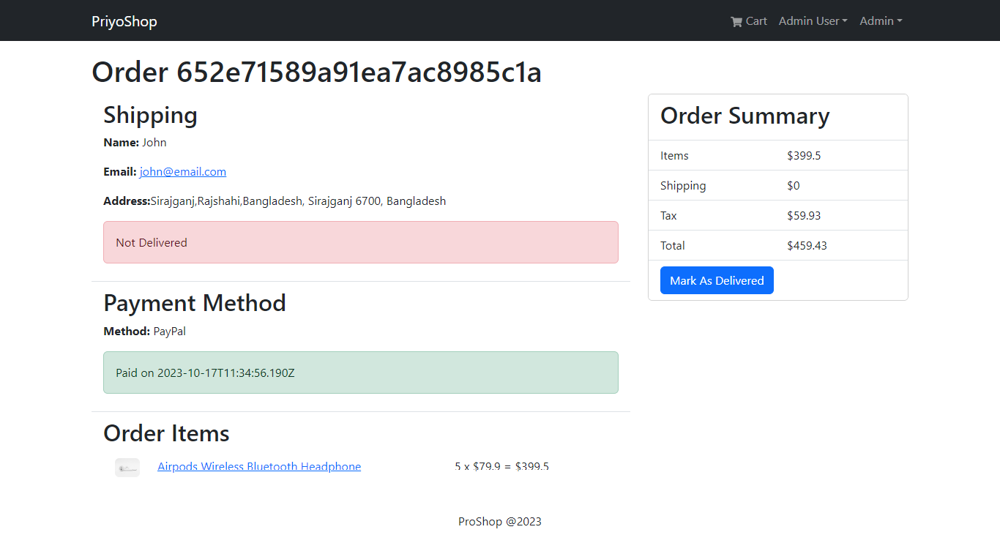

# Mern-Ecommerce

A Mern-Ecommerce fully functional website with paypal payment system.


## Tech Stack

**Client:** React, Redux, Bootstrap, RTK Query

**Server:** Node, Express

**Database:** MongoDB


## Screenshots




## Features

- Full Responsive
- Fast Browsing
- Easy payment
- Seo Friendly


## Installation

Install my-project with npm

```bash
  git clone https://github.com/Hadi4234/mern-ecommerce.git
  cd mern-ecommerce
  npm i
  cd frontend
  npm i
  cd ..
```
    
## Environment Variables

To run this project, you will need to add the environment variables as link .env.example to your .env file

```bash
PORT=5000
MONGO_URI=<your_mongo_db_uri>
JWT_SECRET=<your_secret>
PAYPAL_CLIENT_ID=<your_paypal_client_id>
PAYPAL_APP_SECRET=<your_paypal_secret>
PAYPAL_API_URL=https://api-m.sandbox.paypal.com
```


## Run Development Server

To run this project

```bash
  npm run dev
```
it will run both backend and frondend
<!-- 
## Deployment

To deploy this project run

```bash
  npm run deploy
``` -->


## API Reference

#### Get all users

```http
  GET /api/users
```

| Parameter | Type     | Description                |
| :-------- | :------- | :------------------------- |
| `api_key` | `string` | **Required**. Your API key |

#### Get all products

```http
  GET /api/products
```

| Parameter | Type     | Description                |
| :-------- | :------- | :------------------------- |
| `api_key` | `string` | **Required**. Your API key |


#### Get all orders

```http
  GET /api/orders
```

| Parameter | Type     | Description                |
| :-------- | :------- | :------------------------- |
| `api_key` | `string` | **Required**. Your API key |


<!-- 
#### add(num1, num2)

Takes two numbers and returns the sum. -->

## Work flow
```bash
server.js --> router.js --> controller.js
```

## FAQ

#### Is this website ready to deploy?

Not yet. I am working on it.


## License

[](https://choosealicense.com/licenses/mit/)
[](https://opensource.org/licenses/)
[](http://www.gnu.org/licenses/agpl-3.0)


